> 博客地址：

> [表情包用得好，女朋友不用找](https://www.jianshu.com/p/733f84e5478f)

> [程序员的第一款表情包，你值得拥有](https://www.jianshu.com/p/1637d0c0ca00)

> 知乎回答：[有哪些让你一秒变开心的表情包？](https://www.zhihu.com/question/302378021/answer/566082218)

> 在这个人心浮躁的社会，用文字来沟通往往不尽人意，所以现在我们更喜欢用表情包生动形象表达我们此时此刻的言语

> 但是表情包在通过日积月累，会越来越多，这时找起表情包十分的麻烦，这时你需要这款经过整理的表情包

## B数

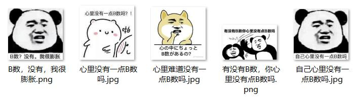

## 搬砖

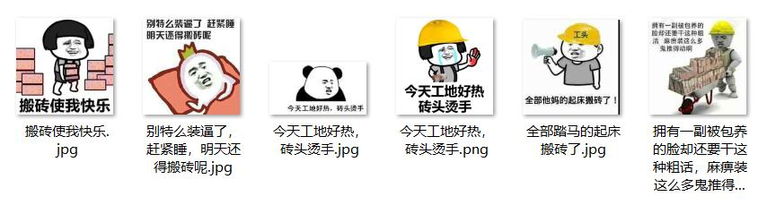

## 背锅


## 操作

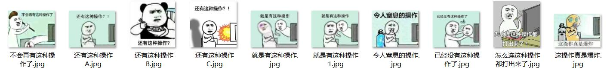

## 撤回

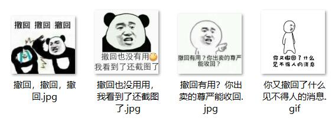

##  猝死

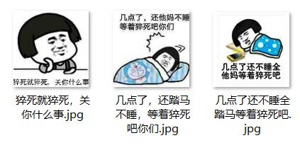

##  大佬

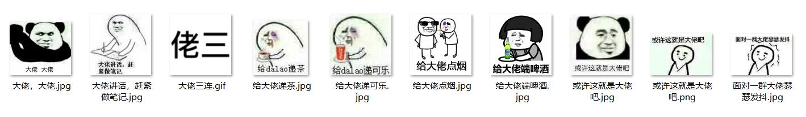

##  干架

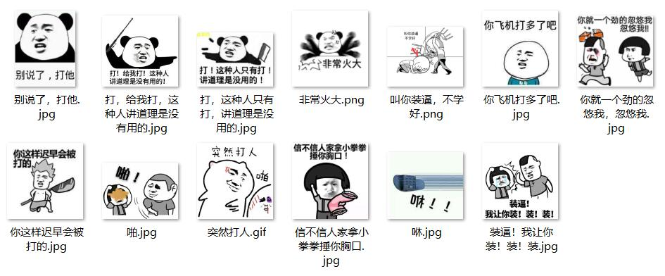

##  红包

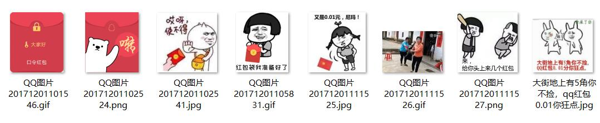

## 老司机

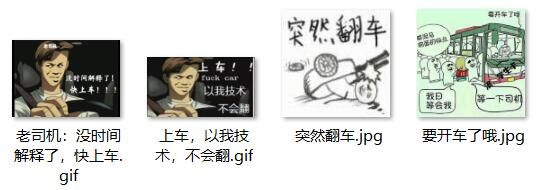

## 伤心

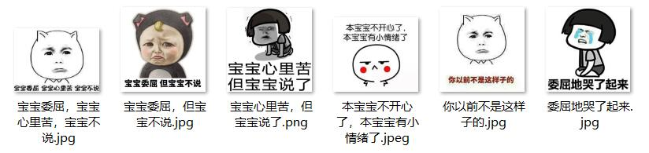

## 套图

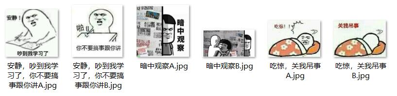

## 咸鱼

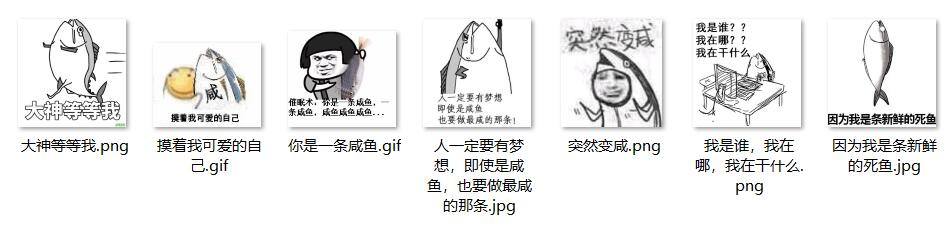

## 新人

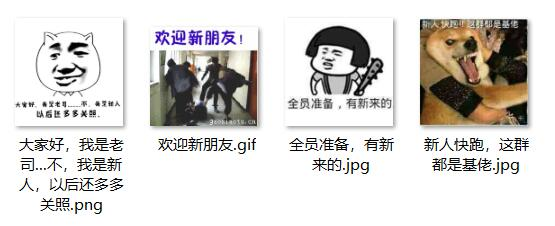

## 文字

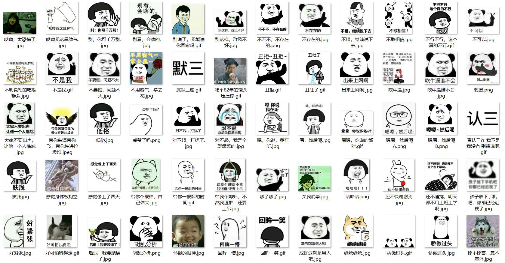

## 表情

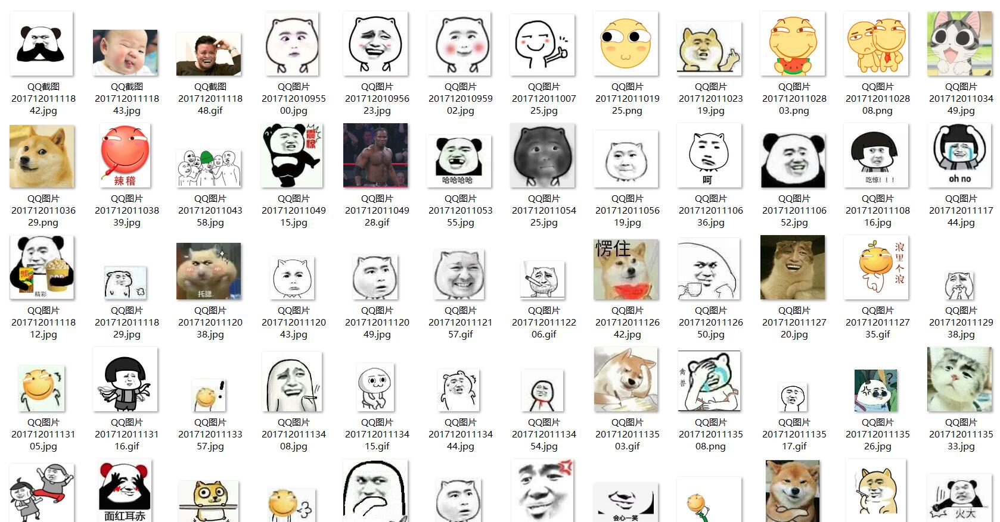

## 程序员

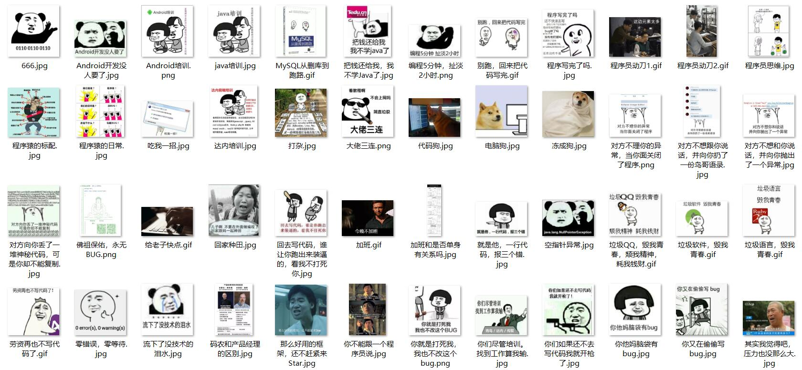

## 夸奖

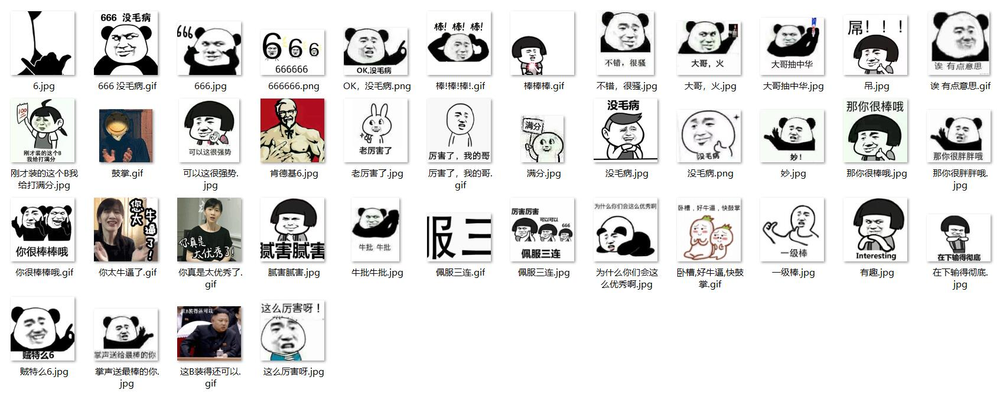

## 安排

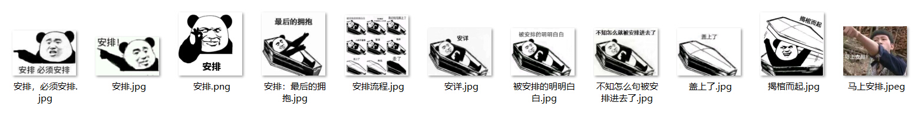

## 单身狗

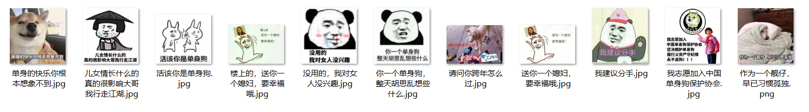

## 斗图


## 尔康


## 反问

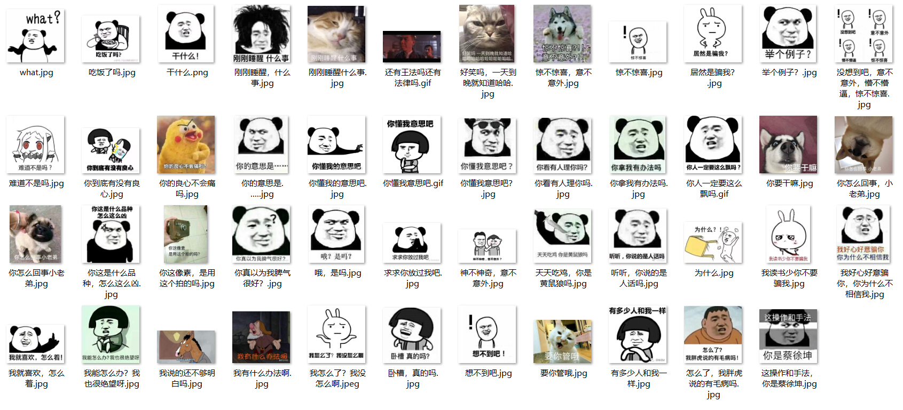

## 敷衍

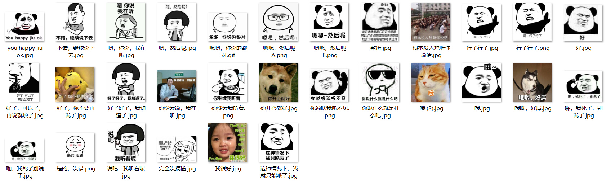

## 富婆

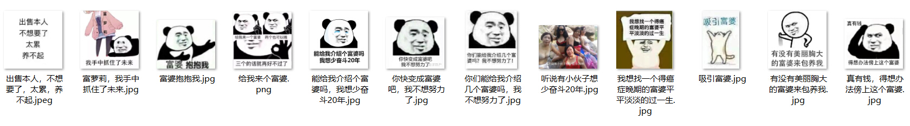

## 工作

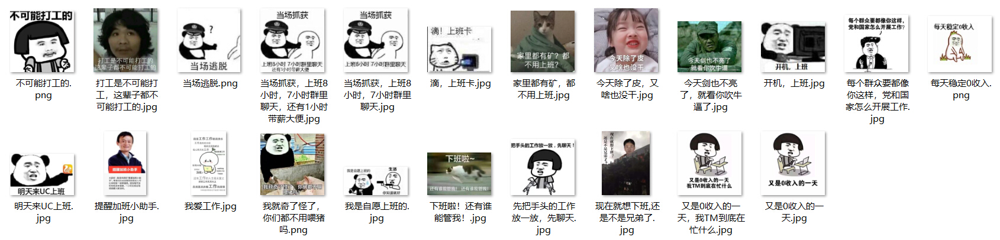

## 害怕

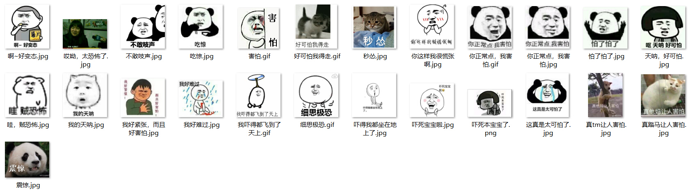

## 回答

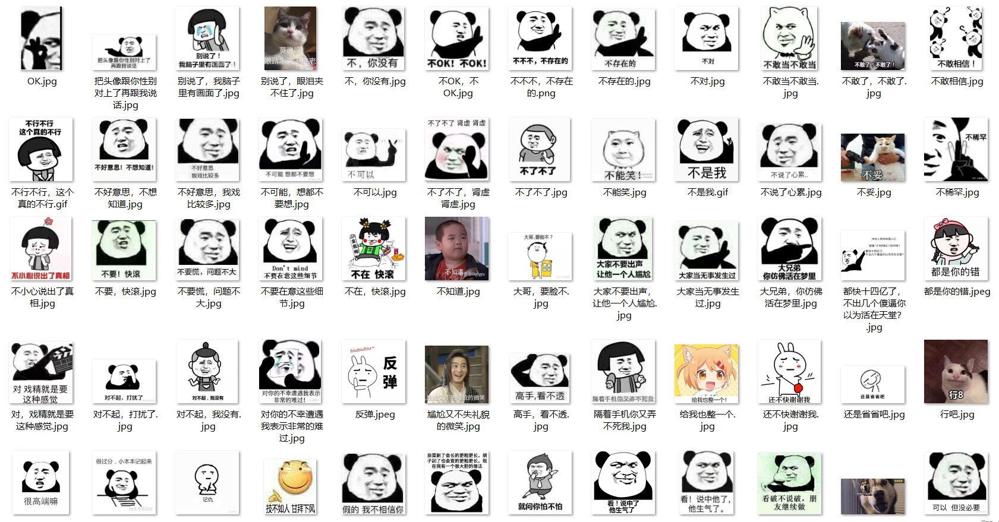

## 基佬

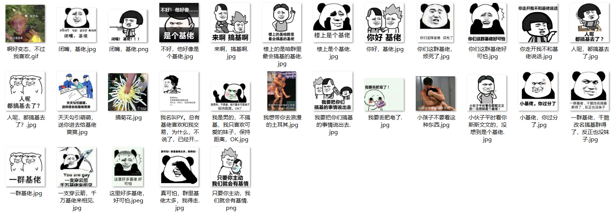

## 群聊

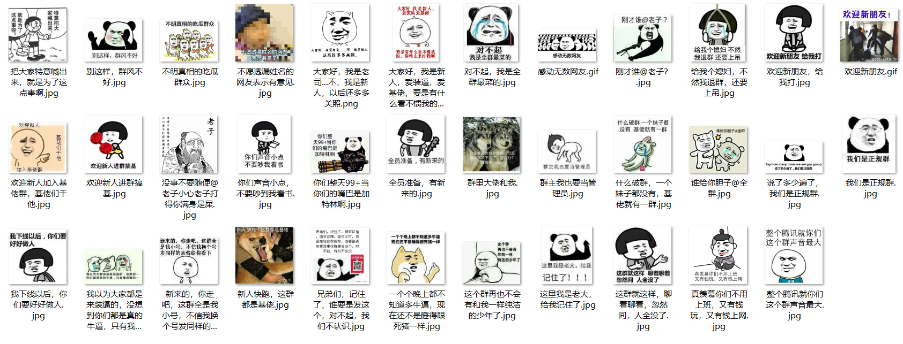

## 三连


## 身材

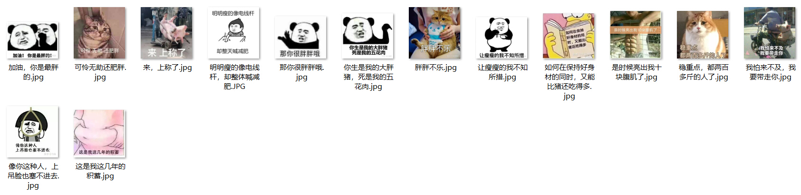

## 套路

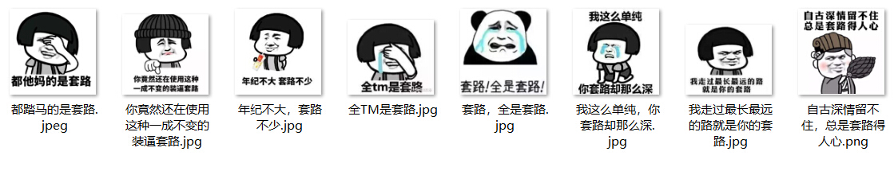

## 天气

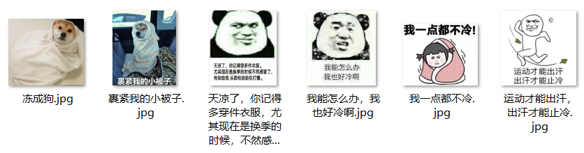

## 文章

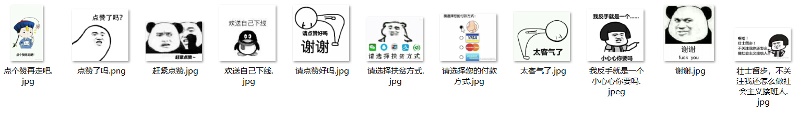

## 学习

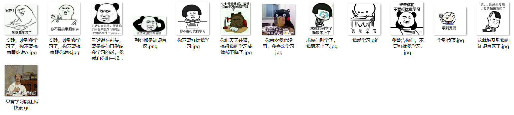

## 鸭子

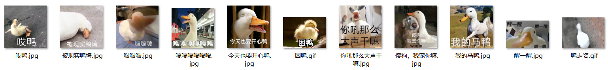

## 装逼

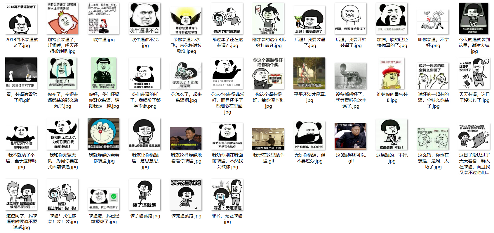

## 自恋

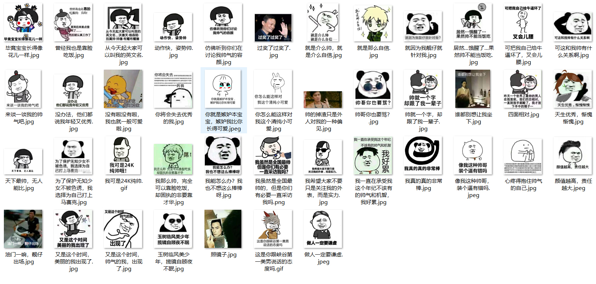

#### 将近上千个表情包，如果查找需要的表情包，可直接搜索关键字

#### 强烈建议将此项目作为Git版本管理项目，享受永久更新

#### 如果你有好的表情包资源，请直接通过 Pull 请求提交给我

#### 请扫描下方的二维码随意打赏，要是能打赏个 10.24 :monkey_face:就太:thumbsup:了。您的支持将鼓励我继续创作:octocat:

 

#### [点击查看捐赠列表](https://github.com/getActivity/Donate)

#### 作者的其他开源项目

* 架构工程：[AndroidProject](https://github.com/getActivity/AndroidProject)

* 网络框架：[EasyHttp](https://github.com/getActivity/EasyHttp)

* 权限框架：[XXPermissions](https://github.com/getActivity/XXPermissions)

* 吐司框架：[ToastUtils](https://github.com/getActivity/ToastUtils)

* 标题栏框架：[TitleBar](https://github.com/getActivity/TitleBar)

* 悬浮窗框架：[XToast](https://github.com/getActivity/XToast)

* 国际化框架：[MultiLanguages](https://github.com/getActivity/MultiLanguages)

## License

```text
Copyright 2018 Huang JinQun

Licensed under the Apache License, Version 2.0 (the "License");
you may not use this file except in compliance with the License.
You may obtain a copy of the License at

   http://www.apache.org/licenses/LICENSE-2.0

Unless required by applicable law or agreed to in writing, software
distributed under the License is distributed on an "AS IS" BASIS,
WITHOUT WARRANTIES OR CONDITIONS OF ANY KIND, either express or implied.
See the License for the specific language governing permissions and
limitations under the License.
```